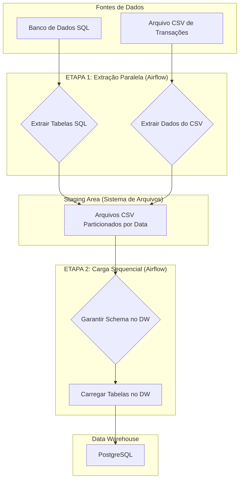

# Pipeline de ETL para o Projeto Banvic


## Sumário
* [Descrição do Projeto](#descrição-do-projeto)
* [Arquitetura do Pipeline](#arquitetura-do-pipeline)
* [Tecnologias Utilizadas](#tecnologias-utilizadas)
* [Estrutura dos Arquivos](#estrutura-dos-arquivos)
* [Como Executar o Projeto](#como-executar-o-projeto)
* [Verificando os Resultados](#verificando-os-resultados)
* [Detalhes da DAG no Airflow](#detalhes-da-dag-no-airflow)
* [Autor](#autor)

## Descrição do Projeto
Este projeto implementa um pipeline de ETL (Extração, Transformação e Carga) robusto e automatizado, orquestrado com Apache Airflow. O objetivo é consolidar dados de diversas fontes da instituição financeira fictícia "Banvic" em um Data Warehouse centralizado para futuras análises de negócio.

As fontes de dados incluem um banco de dados transacional (com informações de agências, clientes, etc.) e um arquivo CSV com dados de transações financeiras.

## Arquitetura do Pipeline
O fluxo de dados foi desenhado para ser eficiente e resiliente, utilizando uma Staging Area para desacoplar as etapas de extração e carga.


## Tecnologias Utilizadas
* **Orquestração:** Apache Airflow 2.8.0
* **Containerização:** Docker e Docker Compose
* **Bancos de Dados:** PostgreSQL 16 (Data Warehouse e Metastore do Airflow)
* **Processamento de Dados:** Python 3.8+ com a biblioteca Pandas
* **Infraestrutura como Código:** SQL para schemas e Docker Compose para o ambiente.

## Estrutura dos Arquivos
O projeto está organizado da seguinte forma para facilitar a manutenção e escalabilidade:
```
├── dags/
│   ├── scripts/
│   │   ├── extracao.py   # Funções de extração
│   │   ├── envio.py      # Função de carregamento (envio) para o DW
│   │   └── esquema.py    # Função para criação do schema no DW
│   └── pipeline_banvic_etl_full.py # Arquivo principal da DAG
├── dados/
│   └── transacoes.csv    # Dados de origem em CSV
├── output/               # Staging Area (criada durante a execução)
├── .env.example          # Template para as variáveis de ambiente
├── .gitignore            # Arquivos e pastas a serem ignorados pelo Git
├── banvic.sql            # Script de inicialização do banco de dados de origem
├── docker-compose.yml    # Arquivo de configuração do ambiente Docker
└── README.md             # Este arquivo
```
## Como Executar o Projeto

Siga os passos abaixo para configurar e executar o pipeline.

### 1. Pré-requisitos
* **Docker** e **Docker Compose** instalados e em execução.
  * [Link para Download do Docker Desktop](https://www.docker.com/products/docker-desktop/)

### 2. Configuração do Ambiente
Antes de iniciar, é preciso configurar as variáveis de ambiente.

1.  Crie uma cópia do arquivo `.env.example` e renomeie para `.env`.
2.  Abra o arquivo `.env` e preencha as credenciais desejadas para os bancos de dados.

### 3. Inicialização dos Serviços
Com o Docker Desktop rodando, abra um terminal na pasta raiz do projeto e execute o comando:

```bash
docker compose up -d --build
```
O comando `--build` garante que a imagem do Airflow seja construída corretamente.

O `-d` executa os contêineres em segundo plano (detached mode).

Aguarde alguns minutos para que todos os contêineres (bancos de dados, scheduler, webserver) estejam saudáveis.

## 4. Acesso e Execução no Airflow
Abra seu navegador e acesse a interface do Airflow: [http://localhost:8080](http://localhost:8080)

Faça login com as credenciais padrão:

- **Username:** admin
- **Password:** admin

Na tela principal, localize a DAG `pipeline_banvic_etl_full`.

Ative a DAG clicando no botão de alternância à esquerda.

Para rodar o pipeline imediatamente, clique no botão de "Play" (▶️) à direita e selecione "Trigger DAG".

## Verificando os Resultados
Após a execução bem-sucedida da DAG, você pode verificar os resultados de duas formas:

### a) Arquivos na Staging Area
A pasta `output/` será criada na raiz do seu projeto. Dentro dela, os arquivos CSV extraídos estarão organizados por data de execução:
```bash
  output/<ano>-<mês>-<dia>/<fonte>/<nome_do_arquivo>.csv
```
### b) Dados no Data Warehouse
Conecte-se ao Data Warehouse com seu cliente de banco de dados preferido (DBeaver, DataGrip, etc.) usando as credenciais do arquivo `.env`.

- **Host:** localhost
- **Porta:** 55432
- **Banco de dados:** banvic (ou o que estiver no seu .env)
- **Usuário e Senha:** (conforme seu .env)

Execute algumas consultas SQL para validar a carga:

```sql
-- Verificar os registros carregados
SELECT * FROM transacoes;
SELECT * FROM agencias;
SELECT * FROM clientes;
SELECT * FROM colaboradores;
SELECT * FROM colaborador_agencia;
SELECT * FROM contas;
SELECT * FROM propostas_credito;
```
## Detalhes da DAG no Airflow
A DAG `pipeline_banvic_etl_full` foi desenhada com foco em robustez e eficiência:

- **Extração Paralela:** As tarefas de extração do CSV e de todas as tabelas SQL são executadas em paralelo para otimizar o tempo total do pipeline.
- **Criação de Schema:** Antes da carga, uma tarefa (`criar_esquema_dw`) garante que a tabela de destino `transacoes` exista, tornando o pipeline autossuficiente.
- **Carga Sequencial:** As tarefas de carga no Data Warehouse são executadas em fila (uma após a outra) para evitar condições de corrida e deadlocks no banco de dados, garantindo a integridade dos dados.
- **Idempotência:** A etapa de carga utiliza o comando `TRUNCATE` antes de inserir novos dados, garantindo que múltiplas execuções para o mesmo dia resultem sempre no mesmo estado final.
- **Controle de Concorrência:** O parâmetro `max_active_runs=1` impede que múltiplas instâncias da mesma DAG rodem simultaneamente, aumentando a estabilidade do ambiente.

## Autor
Gustavo Martins França

LinkedIn: [https://www.linkedin.com/in/gustavo-martins-frança](https://www.linkedin.com/in/gustavo-martins-frança)

GitHub: [https://github.com/gustavomf1/](https://github.com/gustavomf1/)
